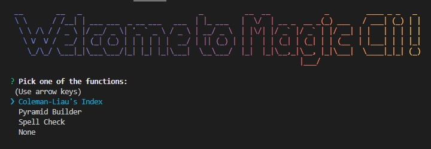
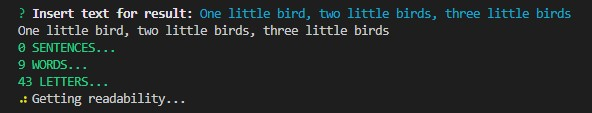
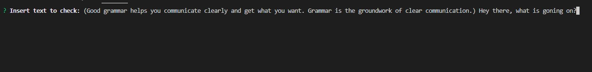
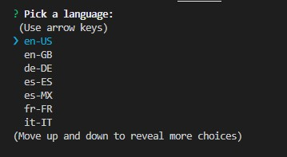
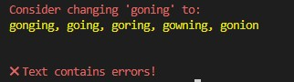
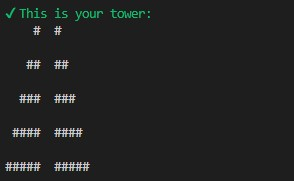

# Magic CLI 🎩🐇
NodeJS built CLI, allows to spell check in 14 languages, get Coleman-Liau Index and build hash Pyramids




# Installing
 - Install dependencies:
  ```pwsh
    npm install
  ```

# Running
 - Run Command Line Interface:
  ```pwsh
    node index.js
  ```

# Interface Preview
- Coleman-Liau Index



- Spell Checker







- Pyramid Builder




# Libraries
 - [figlet](https://www.npmjs.com/package/figlet)
 - [chalk-animation](https://www.npmjs.com/package/chalk-animation)
 - [gradient-string](https://www.npmjs.com/package/gradient-string)
 - [inquirer](https://www.npmjs.com/package/inquirer)
 - [chalk](https://www.npmjs.com/package/chalk)
 - [simple-spellchecker](https://www.npmjs.com/package/[simple-spellchecker)
 - [nanospinner](https://www.npmjs.com/package/nanospinner)
